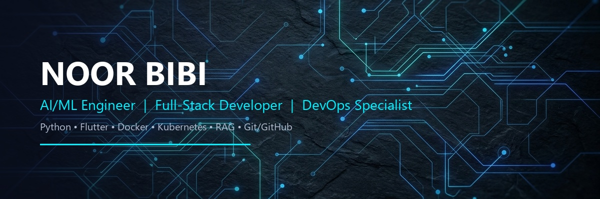

# Welcome to My Profile! 🚀

  

---

  <h3>👋 Hello, I'm Noor Bibi</h3>
  
<strong>AI/ML Engineer | Full-Stack Developer | Mobile Application Developer</strong>

  
📍 Lahore, Pakistan

---

### 📖 About Me

I am an **AI/ML Engineer, Full-Stack Developer, and Mobile Application Developer** with hands-on experience designing intelligent applications, containerized microservices, and automated CI/CD pipelines. I specialize in building and deploying machine learning models, designing Retrieval-Augmented Generation (RAG) architectures, and orchestrating scalable, cloud-native deployments.

My work bridges the gap between AI development and modern software engineering, focusing on creating high-performance, containerized applications backed by robust CI/CD automation.

---

### 🛠️ Technical Skills

<table width="100%">
  <tr>
    <td width="50%" valign="top">
      <h4>🧠 AI / Machine Learning & RAG</h4>
      
      
      
      
      
    </td>
    <td width="50%" valign="top">
      <h4>⚙️ DevOps & Cloud Engineering</h4>
      
      
      
      
      
      
    </td>
  </tr>
  <tr>
    <td width="50%" valign="top">
      <h4>💻 Languages & Frameworks</h4>
      
      
      
      
      
      
      
    </td>
    <td width="50%" valign="top">
      <h4>🗄️ Databases & Web Tech</h4>
      
      
      
      
      
      
      
    </td>
  </tr>
</table>

---

### 📂 Featured Projects

#### 🌟 Atelier — AI-Based Personal Styling Application *(Final Year Project)*
*AI-powered Flutter mobile app and FastAPI backend designed to offer personalized styling recommendations based on computer vision.*
- Developed a **Flutter** application utilizing **computer vision classification models** to generate personalized style profiles from user photos.
- Trained and optimized a twelve-season machine learning model to accurately identify personalized color palettes from user selfies.
- Designed a scalable **FastAPI** backend supporting wardrobe management, outfit planning, and personalized fashion recommendations.

#### 🩺 [MedAssist — RAG-Powered Clinical Knowledge Assistant](https://github.com/noor-bibi-bi/medassist-rag)
*Clinical knowledge assistant delivering accurate, evidence-based medical responses using Retrieval-Augmented Generation.*
- Integrated **dual-layer hallucination mitigation** by combining strict retrieval filtering with LLM relevance validation.
- Achieved **100% evaluation accuracy** across 25 clinical questions spanning five complex medical categories.

#### 🔄 [DevOpsFlow — Containerized CI/CD Platform](https://github.com/noor-bibi-bi/devopsflow-Project)
*A scalable three-tier microservices platform focused on CI/CD automation and container orchestration.*
- Architected a robust three-tier structure using **React**, **Express**, **PostgreSQL**, **Docker**, and **Kubernetes**.
- Built an automated **GitHub Actions** CI/CD pipeline integrating unit testing, vulnerability scans, containerization, and automated cloud deployments.
- Implemented secure cloud-native deployment workflows improving overall application reliability and scaling.

#### 💧 [AquaGuard — AI-Powered Safe Water Quality Prediction](https://github.com/noor-bibi-bi/AquaGuard)
*A comprehensive Machine Learning pipeline that predicts ground and lake water safety based on chemical quality thresholds.*
- Developed a complete data processing and machine learning pipeline comparing **Random Forest** and **XGBoost** classifiers for water potability prediction.
- Labeled and analyzed safety levels using **WHO and IS water safety standards** on combined environmental datasets.
- Built interactive **Folium geospatial mapping dashboards** (including heatmaps and marked safety locations) exported as standalone HTML visualizations.

#### 🗄️ [Spring26 Sakila App — Flask Movie Database Web Application](https://github.com/noor-bibi-bi/spring26_sakila_app)
*A multi-container Python Flask web application designed for interactive management of the MySQL Sakila sample database.*
- Developed a backend using **Flask** and configured MySQL database orchestration within **Docker containers**.
- Implemented a secure **custom Docker network** to establish isolated, reliable container-to-container communication.
- Automated linting pipelines and container builds with GitHub Actions, utilizing `docker-compose` for streamlined local development.

---

### 📊 GitHub Activity & Stats

  
  &nbsp;&nbsp;
  

  

> *Note: If GitHub Stats images are not loading, they may be rate-limited by the public server. You can view my live stats directly on my profile.*

---

### ✉️ Connect With Me

  
  &nbsp;
  

